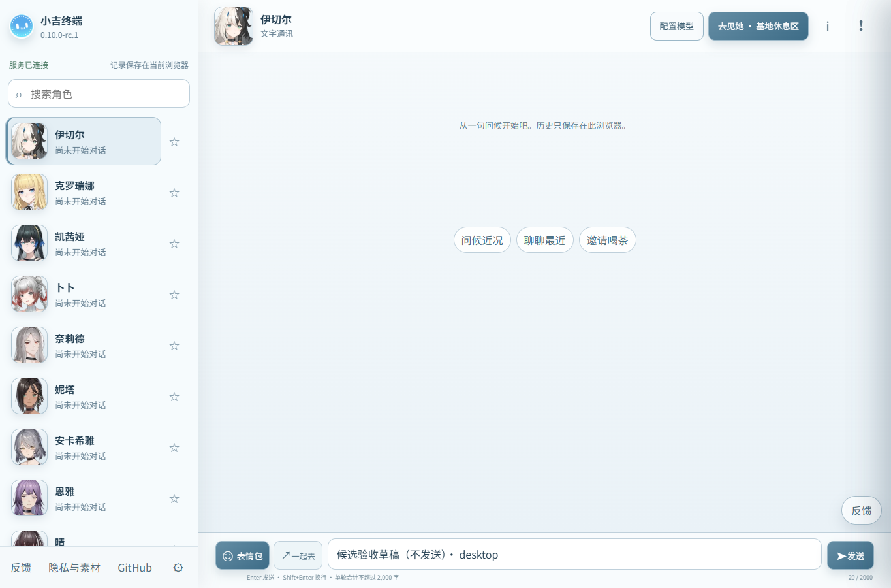
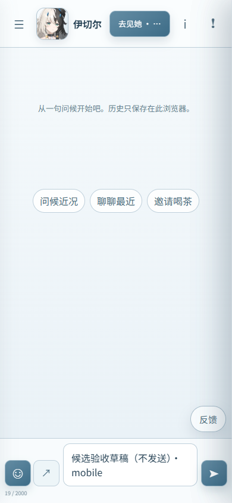

# 小吉终端 S2 候选验收记录

**S2 已完成实际候选验收，尚未批准或切换公网流量。** 候选为 `c35096383928380857cddca6b06f7bb6e6bb8775 / blue`；公网继续运行 S1 `7ce0205f1f9d6fad275b6542c853541ef1224db6 / green`，使用兼容界面。记录时间：2026-09-08 07:36 UTC（香港时间 15:36）。

正式回执：`85d591646eb619956aceebcd73a9c50f8e4c34bafaecb17d95ca78284a33d92a`，状态 `ready_for_review`，预期当前版本固定为 S1。有效至 **2026-09-09 07:36:18 UTC（15:36:18 香港时间）**。过期或任一绑定状态变化时，必须重新验证并准备回执；本记录不代替人工批准。

## 本次改动

- [PR #50](https://github.com/X1aoB/Project_Snow/pull/50) 启用 `current` 前端资源树，显示“小吉终端”名称和高清图标；窄屏按钮在标签内部省略长文本，输入框随内容增长至 140px，再使用原生滚动。调整宽度时保留草稿和选区。
- [PR #49](https://github.com/X1aoB/Project_Snow/pull/49) 根据实际运行配置比较 origin-edge；仅不可变 Caddyfile 路径变化、内容及其余策略相同时保留现有代理。已通过测试和生产只读模型核对，**实际晋级时的保留分支尚待验证**。
- [PR #51](https://github.com/X1aoB/Project_Snow/pull/51) 让普通 stage 仅读取并验证已安装防火墙，拒绝漂移，不重复安装、刷新规则或启停 timer。实际 stage 已通过该分支。

相对 S1，后端、数据库迁移、基础设施配置未改变；embedding、数据、头像、贴纸和全部 14 个不可变配置文件绑定一致。IndexedDB v4、`public-v1`、`public-state-2` 保持兼容。全角色新舞台和公网语音保持关闭，未迁入其他任务的未审核生成物。

## 构建与服务器证据

| 项目 | 已验证结果 |
| --- | --- |
| 最终 main CI | [34197619104](https://github.com/X1aoB/Project_Snow/actions/runs/34197619104)，成功，含完整浏览器和真实 PostgreSQL 检查 |
| 发布证明 | [34198355478](https://github.com/X1aoB/Project_Snow/actions/runs/34198355478)，成功；服务器独立验签于 07:16:45 UTC 完成 |
| 应用镜像 | `ghcr.io/x1aob/project_snow-public@sha256:fa9f005ba49447dba948d4456934fa90c5d23fa8d711a0e745e090b37d7345a3` |
| 前端身份 | `current / 0.10.0-rc.1`，bundle `1c137b64b5b3760fc68f88d25eea119de788975d311a0d9c99cf69a8c11e979c`，实际资源与本地 85 文件构建一致 |
| 候选准备及完成 | 07:23:37 → 07:24:50 UTC；独立调用方观察 wrapper 退出 0，driver 本身也退出 0 |
| 独立后验 | 07:26:13 UTC 完成；25 容器中仅 blue API 被替换，其余 24 个完整受监测记录不变 |
| 恢复资源 | S1 运行容器、恢复环境内容和 inode 保持；41 个既有锚点文件均保留，允许 `latest.json` 索引更新；原始基线与 S1 的应用/embedding 镜像仍可获取 |
| 数据及依赖 | live/ready/full 全部正常；数据包 11、头像包 46、贴纸包 363 个文件分别通过对应校验；角色目录 22 项，私有路由返回 404 |
| 主机配置 | 三份防火墙文件哈希和模式保持；控制器按正式 stage 更新到 c350963，独立维护 helper 仍为原安装代次 |
| 容量及公网 | stage 后可用 17,284,390,912 字节，约 16.1 GiB；07:29 监测全部正常、失败计数为 0；外部 HTTPS build-info 仍返回 S1/compat |

原 blue `502ec99` 容器已被候选替换，**不能再把 blue 槽位当作原始基线**。原版本通过独立锚点 `502ec99412bef843c37e4b31a53df8fa9faeb33c-6b8dc39a7e67dc00625c9e6ec46dec918511d3357d6fa520bbecfaaa13612f22`、保留镜像及永久备份恢复。正常 S2 应用回退目标是仍在线的 S1；应用回退不降低数据库 schema 或覆盖新反馈。

## 实际浏览器验收

07:28:32–07:30:13 UTC，通过经核实的 SSH 私有连接访问实际候选，Chrome 152.0.7977.77。桌面 1365×900 和窄屏 390×844 均通过：引导、22 名角色渲染、配置打开及取消、真实 IndexedDB v4 草稿保存、刷新恢复、输入区可见性。无 JavaScript 或请求错误；32/192/1024 图标内容哈希匹配。

截图已逐张检查。窄屏草稿可完整换行，输入区未被遮挡，无横向溢出；本次明确允许 4 次匿名 presence 请求，未执行模型验证、聊天、摘要、反馈或邮件调用。临时浏览器上下文及 SSH 隧道已关闭。

## 回执索引

以下文件保存在服务器 root 私有目录 `/root/snow-s2-candidate-20260908-v2/`，本地原始副本在集成工作树 `.tmp/s2-candidate-evidence-20260908/`。浏览器原始报告及截图另在 `.tmp/candidate-browser-3bgidc8r/`。

| 文件 | SHA256 |
| --- | --- |
| release-manifest.json | `a70e4b1b5c4b2a485c5f9c541322f1eae9bd219b0e46594a356137dae82bebcb` |
| release-proof.json | `15497c9f28769581362d77318fdb4db39cbd24775a130498aa858b85bbb1caa7` |
| stage-invocation.json | `085e1b0d88e7e5b3ded9031daf565b19bf2d4f791e1880c613ecdba365dbb513` |
| stage-result.json | `4d8a54f269ef35e55ca63fa7a4891209e314987e418c28608b29a1e0dfde47bb` |
| resources-before-stage.json | `80bce526a3ac1994959d8b7d4b690d83c77b39d8b844280b9188740abba9428c` |
| resources-after-stage.json | `717a594cf26419e4d4134a44b40c3bd91dd124ef65599c20a46c6b57a80eaba7` |
| candidate-validation.json | `b38d519dc754808c711990563fc3607fea1e9fa5fa693f145d3dc040ca21f067` |
| browser-report.json | `d0b7ab39f496c17186a9ff069dc075d0eb6d9ef8de2104f3f3212318823a0d92` |
| linux-selftests.json | `dd32b9be0ce5cc55ecb7ea9e0fac75133952b22ddb9ad12dd499fb07eaf4f83d` |
| evidence.json | `01d83d5789a5b787bb87f2acbc0296f606df6d87c0fdbd2c35f2e6a7f2529453` |

辅助脚本曾发现“成功结果文件完整写入后 fsync 失败”的误接受路径，以及验签失败时遗留子进程的回收遗漏。实际 stage 使用修正后的 V2：独立 driver 必须观察 wrapper 真实退出 0，并绑定结果及输入哈希；V2 后验强制要求调用回执。Linux 实测 wrapper 49 项、driver 8 项通过，包含真实子进程晚期 fsync 故障；原未修正版仅做过合成检查，未用于候选部署。测试组有重叠，不合计总数。

## 尚未覆盖的验收

这不是 S2 公网切换、真实手机软键盘、真实模型质量、负载观察或空主机 RTO 的证明。数据库例行维护仍可能写入；资源快照不能证明整机零写入。支持的浏览器回退窗口为 S1→S2→S1，未刷新的原始 502 标签页不自动获得修复。共享设施漏洞修复、外部告警接收端、全角色素材审核及语音交付仍按独立任务推进。

晋级前须确认本回执及预期 S1 仍有效；正式晋级后还需独立核对入口代理保留、实际公网界面、健康状态、备份和回滚路径。
