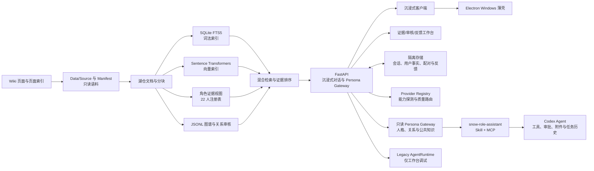

# Project Snow — 可追溯的角色智能对话系统

> 让角色不只“模仿语气”，而是带着她在故事中真实经历过的事情、形成过的关系和延续至今的性格与你交谈。

Project Snow 是一个以《尘白禁区》公开 Wiki 资料为知识基础的角色对话项目。它面向“人物复原”而不是
通用聊天：系统会从主线剧情、个人故事、好感故事、语音、邮件、时装、家具、武器与世界观资料中检索
当前问题真正需要的证据，再结合角色身份、最新剧情状态、交流媒介和当前场景生成回答。

项目并不是把全部资料一次性塞进提示词，而是把资料采集、身份归一、可追溯检索、人格约束、关系审核、
场景连续性、聊天产品和用户反馈拆成独立层。这样既能让角色保留游戏世界中的说话方式和情感关系，也能
追踪回答用了什么资料，并在反馈出现时定位到检索、关系、提示词、媒介还是客户端层。

当前 `v0.5.0` 明确拆开两类产品责任：Snow 的正式产品面负责沉浸式陪伴；角色助手改为 Codex
插件，由 Codex 负责模型、工具、附件、审批和任务历史，Snow 只通过本机只读 Persona Gateway 提供
版本化人格、称呼、关系与公开知识。旧的内置 AgentRuntime 保留一版作为 `/workspace/` 中的 legacy
调试基线，不再继续作为正式助手扩建。

**导航：**
[项目一览](#项目一览) ·
[核心能力](#当前能力) ·
[总体架构](#总体架构) ·
[技术栈](#技术栈) ·
[快速开始](#本地安装) ·
[开发经历](#开发经历) ·
[隐私与许可证](#隐私与提交检查)

> 当前定位：本地、单用户、持续反馈的测试产品。项目不提供公网账号系统，不会把本机聊天记录或
> API Key 上传到外部服务，也不会将 `Data/` 中的 Wiki 语料随源代码提交。

## 项目一览

| 项目 | 当前状态 |
|---|---|
| 可对话角色 | 22 名统一注册角色，NPC 与重复全名不会进入选择器 |
| 资料规模 | 当前验证基线包含 8,799 个文档、5,463 个节点与 6,642 条图谱边 |
| 产品模块 | 沉浸式陪伴 + Codex 角色插件；旧内置助手仅作 legacy 调试 |
| 知识系统 | FTS5 词法检索 + 本地中文向量 + RRF 融合 + 经审核图谱 |
| 本地产品 | 浏览器聊天客户端、证据工作台、Electron Windows 测试壳 |
| 质量保障 | 自动化回归、架构一致性检查、追加式反馈审计与问题族去重 |
| 当前版本 | `v0.5.0`，本地单用户人格网关与 Codex 插件测试版 |

### 它与普通角色 Prompt 有什么不同

1. **设定不是一段不可追踪的总结。** 人格视图保存证据文档和资料层级，模型生成的概括不会反过来成为事实。
2. **情境不会覆盖角色本体。** 时装、装甲、旧剧情场景和当前地点各有作用域，只有用户明确进入对应语境才启用。
3. **问题能够闭环修正。** 每条反馈自动附带角色、模式、媒介、版本和消息上下文，并按问题族识别重复或回归。

### 产品形态

- **体验入口 `/`**：每次桌面客户端启动时显示沉浸式陪伴与角色助手两个独立入口。
- **沉浸式 `/immersive/`**：深冰蓝陪伴界面；隐藏模型、Agent、工具步骤和用量，只在用户主动打开时展示依据。
- **角色助手 `/assistant/`**：白色与钴蓝插件管理中心；配置默认角色、配对/撤销 Codex、预览人格快照和数据边界。
- **内部工作台 `/workspace/`**：用于证据检索、人格档案、关系/实体审核、反馈收件箱，以及旧对话和 Legacy Agent 调试。
- **Electron 客户端**：安全加载本地 Web 产品，不复制语料、不保存模型密钥，也不向页面开放 Node 文件系统。
- **后端 API**：负责角色注册、沉浸式检索与会话、反馈、版本化公共知识、独立用户事实和只读 Persona Gateway。

### v0.5.0 数据隔离与角色插件

- 正式恒约关系从业务代码迁移到 `App/config/public_knowledge/character_relationships.v1.json`，带独立
  `knowledge_version`；聊天无法修改公共设定。
- 用户关系、有效称呼和未来稳定偏好进入独立的 `user_facts.sqlite3`，包含来源、作用域、版本与撤销审计，
  不保存原始消息、摘要、地点、时装或 Agent 轨迹。
- Persona Gateway 只监听本机回环请求并要求可撤销的 Bearer 配对令牌；数据库只存令牌哈希，Codex 当前
  令牌进入 Windows Credential Manager。
- Gateway 只提供人格快照、公共知识检索和结构化关系。沉浸式消息、场景/地点、当前时装、附件、工具日志
  和 Agent 历史明确不在接口返回范围内。
- `plugins/snow-role-assistant/` 包含 Codex Skill 和只读 MCP 服务。每个 Codex 任务固定一个角色与人格版本；
  任务事实先由 Codex 完成，再在不改变数字、公式、代码、路径、引用或工具结果的前提下进行角色化表达。
- 插件只在用户明确使用 `@Snow` 或点名 Snow 角色助手时启用，不能扩大 Codex 的文件、Shell、网络与审批权限，
  也不能把任务消息、附件或推断写回 Snow。
- 反馈处理先归入独立问题族并查找现有回归；已有测试通过的问题只标记 `fixed_verified`，不会反复叠加提示词。
  旧助手 UI 问题统一标记 `superseded_by_architecture`。

## 设计目标

- **人物可复原**：优先使用角色在主线、个人故事、好感故事、语音、邮件、时装和日常资料中的真实表现。
- **证据可追溯**：人格、关系和回答引用尽量保留到文档、页面与章节，不让模型总结成为新的“事实源”。
- **世界观一致**：分析员始终是当前用户；装甲和时装是角色的情境，不是可替换的独立人格。
- **对话有连续性**：当前地点、媒介、关系前提、时装语境和有限历史在会话中延续，但不会污染原始资料。
- **边界可控**：未审核关系、旧剧情场景和低权重物品描述不能擅自覆盖角色核心设定。
- **本地优先**：语料、索引、反馈和聊天历史留在本机；模型供应商可通过 OpenAI-compatible API 替换。

## 当前能力

### 角色与人格

- 统一注册 22 名可对话角色：里芙、芬妮、凯西娅、猫汐尔、芙提雅、伊切尔、克罗瑞娜、卜卜、
  奈莉德、妮塔、安卡希雅、恩雅、晴、琴诺、瑟瑞斯、米娅、肴、胧嫣、苔丝、茉莉安、薇蒂雅、辰星。
- 合并名字与全名别名，例如“芬妮 / 芬妮·戈尔登”“晴 / 鸣濑晴”，避免生成重复人格。
- NPC 和世界观实体保留在语料及图谱中，但不会自动出现在角色选择器。
- 每个角色视图记录直接资料、关联资料、称呼证据、语气证据和资料覆盖等级。
- 资料较少时采用保守、自然的表达，不把其他角色的偏好、口癖和私人关系复制过来。

### 对话模式与交流媒介

人格模式和交流媒介是两条正交维度：

| 维度 | 选项 | 行为 |
|---|---|---|
| 人格模式 | `immersive` 沉浸式 | 角色生活在游戏世界中，不暴露模型、检索、提示词或工具概念 |
| 人格模式 | `assistant` 助手 | 保持角色人格；普通聊天使用只读工具，显式 Agent 任务可在风险审批下执行本机与连接器工具 |
| 交流媒介 | `in_person` 面对面 | 支持独立动作/神态与对白内容块，受当前地点约束 |
| 交流媒介 | `text` 文字通讯 | 只允许消息块，不声称看见用户表情、衣着或已完成物理接触 |

面对面输入区允许“仅动作”“仅对白”或“动作 + 对白”同轮发送。文字通讯会完全隐藏动作输入区。
角色和分析员不在同一地点时，API 返回结构化冲突，让客户端选择“去找她”或“改用文字通讯”。

### 检索、关系与反馈

- SQLite FTS5 负责精确名称、装甲、时装和章节标题的词法召回。
- Sentence Transformers 提供本地中文语义向量；Qdrant 可作为可选向量服务副本。
- Reciprocal Rank Fusion（RRF）融合词法与语义结果，并按当前角色及资料层级约束证据。
- JSONL 图谱是可移植的事实来源；Neo4j 仅是可选的服务投影。
- 叙事关系候选保留原文证据并进入审核层，未经批准不会成为正式图谱边。
- 用户反馈采用追加式记录，按问题族区分首次、重复、待验证、已验证修复和回归候选。

## 总体架构



生成链路会先识别角色、问题焦点、模式、媒介、场景和时装语境，再执行受角色约束的混合检索。
模型返回结构化内容块后，服务端还会检查媒介违规、实现细节泄漏、错误关系称呼、场景跳变、当前事实
伪造和典型连续性问题；必要时进行一次受控重写，仍失败则使用与当前角色和语境相符的确定性兜底。

## 仓库构成

```text
Project_Snow/
├── App/                         可提交的应用层
│   ├── backend/snow_app/        FastAPI、检索、对话、会话与规则
│   ├── frontend/                正式聊天客户端和 /workspace/ 工作台
│   ├── pipelines/               湖仓、索引、人格、图谱及模型审核管线
│   ├── client/                  Electron Windows 安全薄壳
│   ├── docs/                    架构、数据契约和人工审核指南
│   ├── infra/                   Docker、Nginx 与数据库初始化配置
│   ├── scripts/                 开发服务器、架构校验和辅助脚本
│   ├── tests/                   unittest 应用与回归测试
│   ├── runtime/                 本地派生产物和私密状态（Git 忽略）
│   ├── requirements.txt         完整 Python 本地运行依赖
│   └── .env.example             不含密钥的配置模板
├── plugins/snow-role-assistant/ Codex Skill 与只读 Persona MCP
├── .agents/plugins/             仓库内本地 Codex marketplace
├── Data/                        本机 Wiki 原始资料与采集结果（Git 忽略）
├── README.md                    项目总览
├── LICENSE                      GPL-3.0
└── .gitignore                   语料、凭据、运行时和构建产物边界
```

### 关键边界

- `Data/` 是采集层拥有的只读输入契约；应用代码读取它，但不改写它。
- `App/runtime/` 保存可重建或私密的内容，包括索引、审核队列、模型基准、日志、反馈和
  `chat/conversations.sqlite3`。
- `.env`、API Key、Cookie、SQLite、用户反馈、测试截图、`node_modules/` 和 Electron 构建产物都不提交。
- Wiki 图片和音频只在采集阶段保存 URL 或本地测试引用；角色头像缺失时客户端使用文字头像。

## 技术栈

| 层级 | 技术 | 用途 |
|---|---|---|
| 语言与运行时 | Python 3.11+、JavaScript、Node.js 20+ | 后端、管线、Web 与桌面测试壳 |
| API | FastAPI、Pydantic、Uvicorn、HTTPX | 请求契约、异步兼容调用、服务与模型网关 |
| 本地状态 | SQLite、JSONL、DuckDB | 会话、词法检索、湖仓派生表和可移植产物 |
| 语义检索 | Sentence Transformers、Qdrant | 中文向量编码与可选向量服务 |
| 图谱 | JSONL、Neo4j | 经审核关系的源文件与可选查询投影 |
| 文本/媒体处理 | Beautiful Soup、Pillow、PyPDF、PyMuPDF、python-docx、openpyxl、python-pptx、Mutagen | Wiki、图片、扫描 PDF、文档和音频元数据 |
| Agent 与凭据 | Codex 插件、MCP、Windows Credential Manager / keyring | 外部 Agent 执行、只读人格接入与可撤销配对 |
| 浏览器自动化 | Playwright / Chromium | 公开网页提取、表单填写与受控下载；最终提交始终审批 |
| Web 客户端 | 原生 HTML、CSS、JavaScript、Lucide 图标 | 无前端框架依赖的聊天和工作台界面 |
| 桌面客户端 | Electron、electron-builder | Windows 测试壳与 portable 构建 |
| 测试 | Python `unittest`、Electron smoke、架构校验脚本 | API、对话规则、持久化、响应式界面和产物一致性 |
| 可选服务 | Docker Compose、PostgreSQL、Qdrant、Neo4j、Nginx | 本地服务化和图谱/向量投影 |

## 数据与检索层级

采集资料按主线、个人故事、好感故事、随机事件、角色资料、语音、时装、邮件、家具、武器、道具、
后勤、探索、活动和世界观等类别保存。应用层不会仅凭文件名决定人格事实，而是结合 Manifest、页面关系、
角色/装甲/时装 ID 和章节提示建立资料层级。

默认检索优先级：

1. 当前角色直接关联的角色资料、个人故事、好感故事、主线表现和语音；
2. 当前角色装甲明确关联的后勤、武器、邮件、家具和时装资料；
3. 明确提及当前角色的主线、活动、随机事件及共享经历；
4. 全局世界观背景；
5. 没有直接证据时使用中性表达，不补写未经支持的个人事实。

时装是“情境化人格补充”。用户没有明确激活某套时装时，以角色本体和最新剧情状态为准；明确提及时，
只在对应语境中使用该时装的语气和描述，不让特殊台词永久污染角色本体。

## 本地安装

### 前置条件

- Windows 10/11 或其他可运行 Python 的系统；当前桌面壳主要在 Windows 验证。
- Python 3.11 或更高版本。
- Node.js 20 或更高版本（仅运行或打包 Electron 客户端时需要）。
- 已准备的本地 `Data/` 语料；源代码仓库本身不包含 Wiki 数据。
- 可选的 OpenAI-compatible 模型 API；没有密钥时可浏览工作台，但不能生成在线模型回复。

### 安装 Python 依赖

```powershell
cd Project_Snow\App
python -m venv .venv
.\.venv\Scripts\Activate.ps1
python -m pip install --upgrade pip
python -m pip install -r requirements.txt
python -m playwright install chromium
Copy-Item .env.example .env
```

`requirements.txt` 是“完整本地应用”依赖集，包含 API、资料处理、混合检索和可选图谱客户端。
测试使用 Python 标准库 `unittest`，不要求额外安装 pytest。

### 模型配置

只在本机 `App/.env` 中填写配置。最小聊天配置如下：

```dotenv
MVP_CHAT_ENABLED=true
MVP_CHAT_PROVIDER=openai-compatible
MVP_CHAT_BASE_URL=https://your-provider.example/v1
MVP_CHAT_API_KEY=replace-with-your-local-key
MVP_CHAT_MODEL=your-model-name
MVP_CHAT_TIMEOUT_SECONDS=120
MVP_CHAT_IMMERSIVE_TEMPERATURE=0.45
MVP_CHAT_ASSISTANT_TEMPERATURE=0.20
# 助手模式允许更详细的回答；以下是可见分析过程和只读联网工具的上限
MVP_CHAT_ASSISTANT_MAX_TOKENS=8192
MVP_CHAT_WEB_TIMEOUT_SECONDS=15
MVP_CHAT_WEB_MAX_RESULTS=5
```

关系候选抽取、传统独立复核和经校准的 Qwen Batch 自动审核分别使用 `RELATION_CANDIDATE_*`、
`RELATION_REVIEW_*` 和 `EVIDENCE_REVIEW_*`，它们不会自动复用聊天密钥。进程环境变量优先于
`.env`；不要把真实密钥粘贴到 README、issue、截图或提交记录中。

`v0.5.0` 也可以在客户端“设置 → 模型厂商”中选择 ChatGPT/OpenAI、DeepSeek、Qwen、GLM、
Kimi 或自定义兼容接口。五个内置厂商只需填写 API Key：后端先把 Key 写入 Windows 凭据库，
再从厂商 `/models` 接口读取当前账户可用模型。自定义兼容接口才需要填写 API 地址，并可在模型
发现不可用时手动填写模型 ID。Provider 还需要被明确授权接收图片、文档或音频，路由器才会把
对应附件发给它；尚未验证的视觉、STT 和 TTS 能力不会根据模型名称自动开启。

模型“可选择”与“已验证”是两个状态：厂商发现的文本模型可以立即手动选择；只有通过基础文本
连接测试的模型才会进入质量优先自动路由。结构化输出、流式、视觉或工具调用探测失败，只会关闭
相应能力，不会再把普通文本模型整体判为不可用。沉浸式、助手问答和 Agent 分别保存默认模型。
沉浸式强制关闭 thinking；助手普通问答默认关闭，复杂分析和 Agent 按任务启用。厂商隐藏推理
不会显示在客户端，可收起的角色化分析过程是单独生成并校验的用户可见摘要。

如需直接在 Windows PowerShell 中切换一个默认厂商，可在 `App` 目录执行以下命令。把地址、Key
和模型 ID 换成厂商控制台提供的实际值，并在同一个 PowerShell 窗口重启 API：

```powershell
$env:MVP_CHAT_ENABLED = "true"
$env:MVP_CHAT_PROVIDER = "openai-compatible"
$env:MVP_CHAT_BASE_URL = "https://your-provider.example/v1"
$env:MVP_CHAT_API_KEY = "<你的 API Key>"
$env:MVP_CHAT_MODEL = "<厂商提供的模型 ID>"
python -m uvicorn backend.snow_app.main:app --host 127.0.0.1 --port 8000
```

客户端会根据所选厂商自动生成可复制的当前会话和 Windows 用户级环境变量命令。环境变量模型继续
作为兼容回退，但不会被静默用于私人附件；ChatGPT 订阅本身也不等同于 OpenAI API Key。

常用新增接口：

```text
POST   /api/v1/attachments
POST   /api/v1/attachments/{id}/transcription
GET    /api/v1/models
GET/POST /api/v1/providers
POST   /api/v1/providers/{id}/probe
POST   /api/v1/providers/{id}/discover-models
POST   /api/v1/models/defaults
POST   /api/v1/agent/runs
GET    /api/v1/agent/runs/{id}
GET    /api/v1/agent/runs/{id}/events
POST   /api/v1/agent/runs/{id}/approvals/{approval_id}
POST   /api/v1/agent/runs/{id}/retry
GET    /api/v1/artifacts/{id}
GET/POST /api/v1/connectors
POST   /api/v1/connectors/oauth/start
```

附件、Agent 状态、审批和 Artifact 保存在 `App/runtime/chat/agent.sqlite3` 及相邻运行时目录中；
删除源附件会同步移除其本地派生状态。Agent 的技术任务记录不会自动进入沉浸式人格记忆。

## 构建运行时资料

首次运行或 `Data/` 更新后，在 `App/` 下执行：

```powershell
python -m pipelines.run_stage --stage b --skip-vector
python -m pipelines.run_stage --stage c
python -m pipelines.build_dialogue_profiles
python -m pipelines.build_mvp_views
```

如需本地语义向量索引：

```powershell
python -m pipelines.build_vector_index
```

这些命令只写入 `App/runtime/`。它们不会修改 `Data/`、原始页面、人工审核决定或正式图谱边。

## 启动服务

在第一个 PowerShell 窗口启动 API：

```powershell
cd Project_Snow\App
.\.venv\Scripts\Activate.ps1
python -m backend.snow_app.main
```

在第二个 PowerShell 窗口启动 Web 服务与 API 代理：

```powershell
cd Project_Snow\App
.\.venv\Scripts\Activate.ps1
python scripts/dev_server.py
```

- 聊天客户端：<http://127.0.0.1:8080/>
- 证据、关系、实体、反馈与调试工作台：<http://127.0.0.1:8080/workspace/>
- Web 健康检查：<http://127.0.0.1:8080/health>
- FastAPI：<http://127.0.0.1:8000/>

### Electron Windows 测试客户端

Web 和 API 服务启动后：

```powershell
cd Project_Snow\App\client
npm ci
npm start
```

冒烟测试和 portable 构建：

```powershell
npm run smoke
npm run package:win
```

Electron 只是沙箱化的浏览器薄壳，不包含 Python、`Data/`、API Key 或另一套聊天实现。
生成物位于 `App/client/dist/`，且仍要求本机 API 与 Web 服务处于运行状态。

### 安装与配对 Codex 角色插件

先启动 API 和 Web，然后打开 `http://127.0.0.1:8080/assistant/`，选择默认角色并点击“配对 Codex”。
配对令牌只在数据库中保存 SHA-256 哈希；当前 Codex 凭据由 Windows Credential Manager 保存。

首次开发安装在仓库根目录执行：

```powershell
codex plugin marketplace add .
codex plugin add snow-role-assistant@personal
```

之后新建 Codex 任务并输入 `@Snow`。若修改了插件，先运行 `plugin-creator` 提供的 cachebuster 更新脚本，
重新安装插件并新建任务，使 Codex 加载新的 Skill 与 MCP。撤销配对可在 `/assistant/` 完成。

## API 与本地持久化

主要接口：

- `GET /api/v1/mvp/status`：模型与 MVP 状态。
- `GET /api/v1/mvp/bootstrap`：22 角色、覆盖统计、会话摘要和反馈类别。
- `POST /api/v1/mvp/chat`：兼容旧客户端的聊天入口，支持模式、媒介、动作/对白块和幂等消息 ID。
- `GET /api/v1/mvp/conversations/{character_id}`：分页读取某角色本地历史。
- `DELETE /api/v1/mvp/conversations/{character_id}`：清理所选本地聊天历史。
- `POST /api/v1/mvp/feedback`：提交带角色、模式、媒介、版本和消息上下文的反馈。
- `POST/DELETE /api/v1/persona/pairings*`：创建或撤销本机 Codex 配对。
- `GET /api/v1/persona/snapshot/{character_id}`：读取版本化、无聊天历史的人格快照。
- `GET /api/v1/knowledge/search`：按角色检索可追溯的公共知识。
- `GET /api/v1/relationships/{character_id}`：读取结构化关系与有效称呼。
- `GET /api/v1/mvp/tools` 和 `/api/v1/agent/*`：保留一个版本的 Legacy Agent 调试接口。
- `/api/v1/review/*`：内部关系和实体审核接口。

沉浸式显示历史保存在 `App/runtime/chat/conversations.sqlite3`；结构化用户事实保存在相邻的
`user_facts.sqlite3`；Persona 配对只保存于 `persona_pairings.sqlite3` 和 Windows 凭据库。三个存储没有
原始消息复制关系。Legacy Agent 的任务和附件仍留在旧运行时数据库，仅供工作台对照调试，Codex 插件不读取它们。

反馈源文件保持追加式审计。系统在读取时把旧的宽泛问题族投影为精确问题族，并记录验证测试、代码版本和验证时间；
不会改写历史 `feedback.jsonl`。只有当前版本可复现且能形成失败测试的问题才重新进入代码修改。

## 验证

```powershell
cd Project_Snow\App
python -m unittest discover -s tests -p "test_*.py"
python scripts/validate_architecture.py
node --check frontend/app.js
```

桌面端还可在 API 与 Web 运行时执行：

```powershell
cd client
npm run smoke
```

架构校验会确认文档、节点、关系、人格视图和审核产物之间的引用一致性。反馈回归测试覆盖角色称呼、
主线最新状态、时装语境、媒介边界、场景位置、当前活动、共享用餐、重复口癖和双输入客户端等问题。

## 开发经历

Project Snow 的实现经历了以下阶段。这里记录的不只是功能列表，也说明当前架构为何采用这些边界。

### 1. 从页面采集转向“具体内容 + 稳定命名”

早期采集能找到故事入口，但好感故事、主线、随机事件和邮件等页面存在多层索引：栏目下面还有篇目、
章节和小章节。只保存入口页会得到大量没有正文的文件。采集策略因此改为沿页面关系递归发现具体内容，
以 canonical URL、修订信息、HTTP 缓存头和规范化正文哈希支持增量更新，并为主线、角色、装甲、武器、
时装、家具、邮件和探索资料建立适合人工浏览的稳定命名。

这一阶段还确立了两个原则：媒体第一阶段只保存 URL/HTML 引用；价格、版本、奖券和获取方式保留为
机制元数据，但不默认当作人格背景。

### 2. 建立角色资料层级和只读数据边界

角色页面被确认不仅是索引，还聚合了性格、背景、装甲、故事、心意、生日、语音、邮件和物品关系。
项目把 `Data/` 固定为只读语料，把所有分块、索引和审核结果移入 `App/runtime/`。角色名、全名、装甲名、
NPC 与导航页被拆开处理，避免把“推荐说明”“类型”“未关联角色”等导航字段误建成人格。

### 3. 先完成 B：人格优先的混合检索

应用先构建湖仓文档、FTS5 词法索引、可选语义向量、角色证据库存和 22 人统一注册表。检索使用 RRF
融合，但先受角色和资料层级约束。这样即使向量结果相似，也不会轻易把另一名角色的口癖或关系借给
当前角色；时装文本也不会压过主线与角色本体。

### 4. 再完成 C：关系候选、模型比较与审核分层

叙事关系抽取曾使用 Qwen 与 DeepSeek 在相同样本上比较成功率、速度、token、候选数量和三元组重合度。
实践表明“候选更多”不等于“关系更准确”，而数千条逐项人工审核也不现实。因此关系层采用：确定性证据
校验、第一模型抽取、独立第二模型保守复核、风险分层和人工抽查。模型报告始终是建议，不会直接写入
正式图谱。

### 5. 从 5 角色 MVP 扩展到 22 角色

首批角色用于验证资料检索、称呼、关系和说话方式；随后移除五人硬编码，统一由注册表驱动选择器、问题库、
场景状态和对话服务。所有角色默认处于资料中的最新剧情状态，不再维护多个可切换的历史剧情阶段。

### 6. 将“人格模式”和“交流媒介”拆开

沉浸式/助手解决的是角色是否知道系统和工具；面对面/文字通讯解决的是角色能感知和执行什么。两者混在
一起会出现文字通讯中触碰用户、面对面却像发消息等违和行为，因此后端增加结构化内容块、轻量世界位置、
异地冲突和媒介切换规则，前端按每条消息实际媒介渲染。

### 7. 从证据工作台重构为聊天产品

原先的单页工作台适合调试，却不适合长期使用。项目新增聊天软件式三栏界面、角色列表、固定输入区、
模式/媒介开关、信息抽屉、SQLite 历史、幂等重试和 Electron 薄壳；旧检索和审核能力保留在
`/workspace/`。反馈类别被压缩为角色表现、知识记忆、对话体验、客户端功能和其他五类，让用户可以先
选择大类，再自由描述问题。

### 8. 用真实反馈修正连续性，而不是无限堆提示词

持续使用暴露了机械拒答、关系背景缺失、主线最新状态不明确、输出结构泄漏、角色口癖重复、地点跳变、
当前活动矛盾、已带来食物却重新询问、亲密语境突然重置以及输入框交互等问题。修复方式逐步从通用
“更像角色”提示改为可测试的问题焦点、上下文卡片、局部校验器和有限兜底，并给反馈建立稳定问题标识，
区分已修复与真实回归，避免反复修改同一问题。

### 9. 将正式助手收敛为外部 Agent 人格插件

内置助手逐步加入联网、附件、工具、审批和执行过程后，实际上开始重复实现一个通用 Agent，同时仍难以达到
Codex 等成熟宿主的工具广度与恢复能力。项目因此停止在 Snow 内继续扩建正式 Agent：公共设定、用户事实、
沉浸式历史和 Agent 数据被拆成独立域，Snow 通过只读 Persona Gateway 与 Codex Skill/MCP 提供角色层。
这使基础恒约设定可以共享，而个人聊天、场景与任务历史不会跨模块流动。

## 当前限制与后续方向

- 当前是本地测试产品，不包含公网认证、多用户隔离、跨设备同步或生产级密钥托管。
- Codex 是第一个插件宿主；Hermes、AstrBot 与微信消息入口尚未适配。AstrBot 后续只作为消息网关，不管理人格或记忆。
- Snow 内置 AgentRuntime 只保留 legacy 调试，不保证继续扩展其工具和客户端体验。
- 低资料覆盖角色的自然度仍依赖后续资料补充和真实使用反馈。
- 未审核关系不会自动成为人格事实；高风险或多义关系仍需要人工确认。
- Electron portable 目前不打包 Python、语料和模型环境，使用前需先启动本地服务。
- Wiki 资料和媒体可能有独立许可要求；仓库的 GPL-3.0 只覆盖本仓库提交的源代码与文档。

## 隐私与提交检查

提交前至少执行：

```powershell
git status --short
git diff --check
```

允许提交源码、测试、文档、无密钥模板和依赖锁文件；不要提交：

- `Data/` 原始 Wiki 语料；
- `App/runtime/`、SQLite、反馈、日志、模型基准和截图；
- `.env`、API Key、Cookie、证书和其他凭据；
- `node_modules/`、Electron `dist/` 和缓存；
- 未确认可再分发的 Wiki 图片、音频和视频。

详细应用命令见 [App/README.md](App/README.md)，架构与数据约束见
[App/docs/architecture.md](App/docs/architecture.md) 和
[App/docs/data_contract.md](App/docs/data_contract.md)。

## 许可证

本仓库提交的源代码与文档采用 [GNU General Public License v3.0](LICENSE)。`Data/` 中的第三方 Wiki
内容、游戏文本和媒体不随仓库分发，并继续受其原始来源和页面许可证约束。
